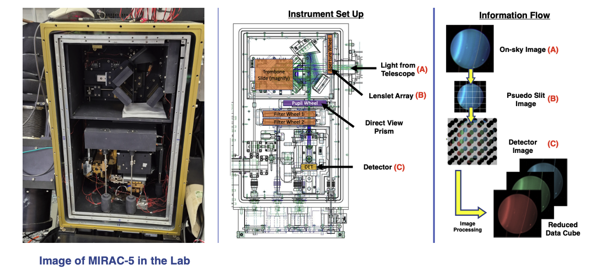

##### 

---

## Overview

The fifth iteration of the MIRAC (Mid-Infrared Array Camera) instrument is an imager that can capture light between 3 - 13 microns. MIRAC-5 will leverage an annular groove phase mask coronagraph and the MMT adaptive optics system to characterize directly imaged exoplanets and circumstellar disks. We will upgrade MIRAC-5 to have a low resolution N-band (7.5 -13 micron) IFU mode. This instrument upgrade will be a technical demonstration for <a href="/instrumentation/tempo/">TEMPO</a>.

I have funding for a graduate student to work on this project.

You can read the history of MIRAC at this 
<a href="https://lweb.cfa.harvard.edu/~jhora/mirac/">link</a>.

##### 

---

### IFU Upgrade Team Members
Brittany Miles

Manny Montoya

Oli Durney

Changgon Kim

Simran Argarwal

Heejoo Choi

Jarron Leisenring

### Science Team Members

Kevin Wagner

Michael Meyer

---

