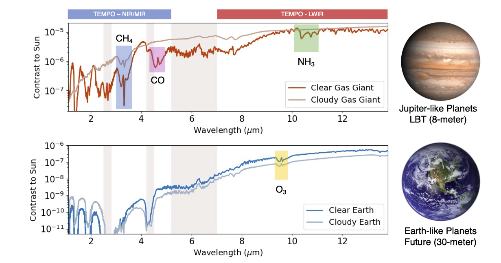
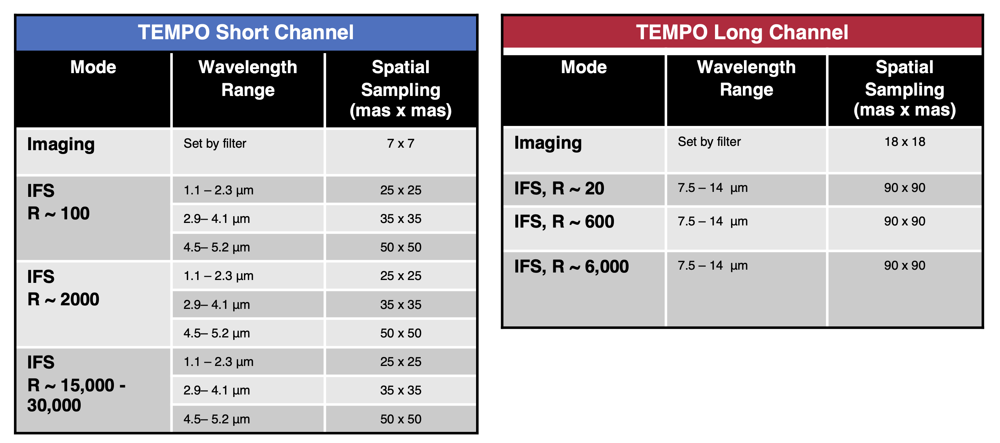

##### 

---

## Overview

We are developing TEMPO, the Thermal-IR Exoplanet Imager and Spectrograph for the Large Binocular Telescope to do in depth atmospheric characterization of existing exoplanets, Solar System gas giants, circumstellar disks, and demonstrate the potential capabilities of 30-m class telescopes to find and characterize Earth-like planets. TEMPO will have two channels, near to mid-infrared and long-wavelength infrared, each with imaging and integral field spectrograph (IFS) modes to accomplish this goal. TEMPO will be the first instrument ever to spectroscopically characterize Jupiter-like exoplanets within the N-band (7.5--14 $\mu$m) from the ground. This technical feat is an important step on the path to studying rocky, Earth-like planets on 30-meter class facilities.

##### 

---

### Instrument Team Members
Brittany Miles

Manny Montoya

Heejoo Choi

Changgon Kim

Andre Wong

Jarron Leisenring

Ella Butler

### Support
Initial phases of the conceptual design were supported by the Heising-Simons Foundation 51 Peg b Fellowship. Lenslet array prototyping and optical design work is supported by the University of Arizona Space Institute.

---

