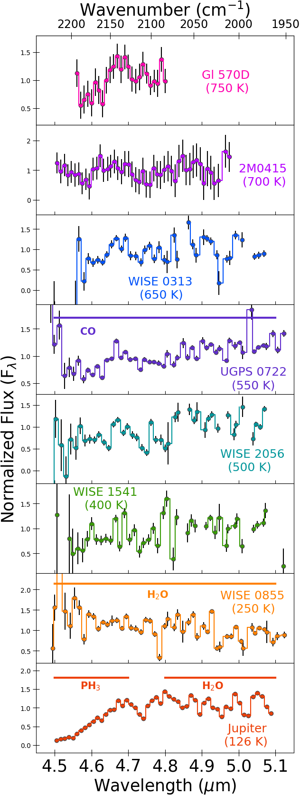

---

##### Summary

Cold brown dwarfs are excellent analogs of widely separated, gas giant exoplanets, and provide insight into the potential atmospheric chemistry and physics we may encounter in objects discovered by future direct imaging surveys.  For this project we completed a low resolution (R∼300) M-band spectroscopic sequence of seven brown dwarfs with effective temperatures between 750 K and 250 K along with Jupiter. These spectra reveal disequilibrium abundances of carbon monoxide (CO), which are produced by atmospheric quenching driven by convection.  We estimated the strength of vertical mixing from the CO abundances by calculating the eddy diffusion coefficient (Kzz) for each brown dwarf and Jupiter. The Kzz values of cooler objects are close to their theoretical maximum and warmer objects show weaker mixing, likely due to less efficient convective mixing in primarily radiative layers. The CO-derived Kzz values imply that disequilibrium phosphine (PH3) should be easily observable in all of the brown dwarfs, but none show any evidence for PH3 absorption.  We find that ammonia (NH3) is relatively insensitive to atmospheric quenching at these effective temperatures.

You can read the paper and get the spectra <a href = "https://ui.adsabs.harvard.edu/abs/2020arXiv200410770M/abstract"> here. </a>

---

##### Figure 1: The brown dwarf spectral sample including Jupiter. This pre-JWST-era paper connected the chemistry seen in the coldest brown dwarfs and the Solar System's biggest gas giant, Jupiter.

---

<iframe style="border-radius:12px" src="https://open.spotify.com/embed/track/2EznBGrlmx9wBeYgyDojsA?utm_source=generator" width="100%" height="80" frameBorder="0" allowfullscreen="" allow="autoplay; clipboard-write; encrypted-media; fullscreen; picture-in-picture"></iframe>

