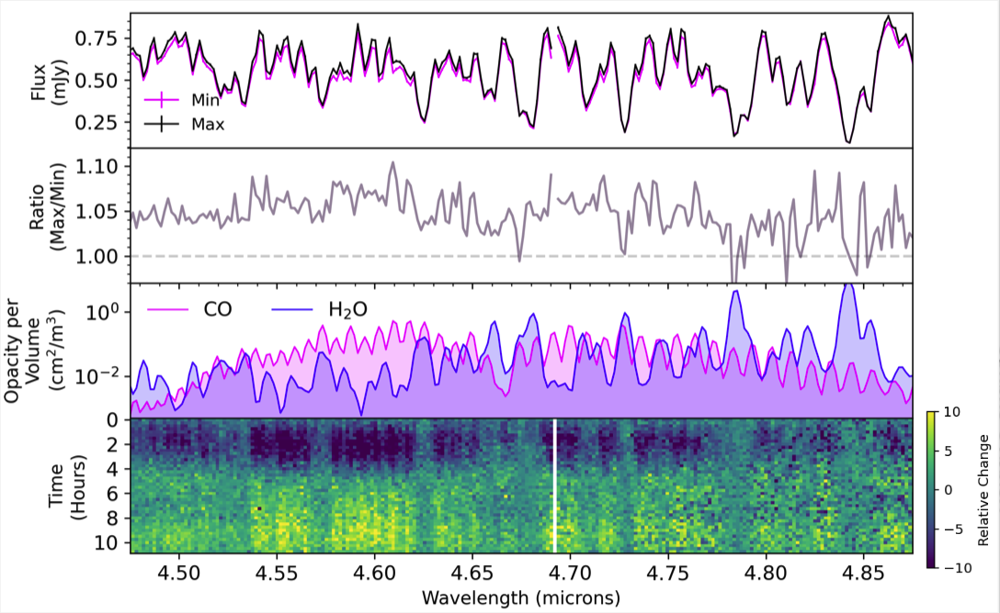

---

 WISE 0855 is one of our closest and coolest neighbors. This brown dwarf is only about 2 Jupiter masses, the same radius as Jupiter, and has a temperature of 265 K, cooler than Earth. We used NIRSpec on JWST to take a mid-infrared spectrum (2.87 - 5.27 microns) of WISE 0855 every 15 minutes over an 11 hour period. The variations within the time-series are wavelength dependent with the dominant changes occuring within the carbon monoxide absorption bands. Variable signatures of phosphine were also observed. Changes within the water vapor bands are significantly muted compared to the disequilibrium (carbon monoxide and phosphine) molecules which are impacted by deeper convection. Models that include water clouds are required to match the overall spectrum.

##### Figure: Spectral light curves of WISE 0855 focused on wavelengths impacted by carbon monoxide and water vapor. The mininum and maximum brightness spectrum are plotted along with the relative changes over time in the bottom panel.

We used principal component analysis to understand the driving forces behind the time-series data. The light curves must be the result of a combination of at mininum two different surface features on WISE 0855. The observed changes in carbon monoxide and phosphine are impacted by low altitude changes in temperature. Higher altitude variations could be the result of temperature variations and water clouds changing thickness in the visible hemisphere.

You can read the paper <a href = "https://arxiv.org/abs/2609.20664"> here. </a>

---