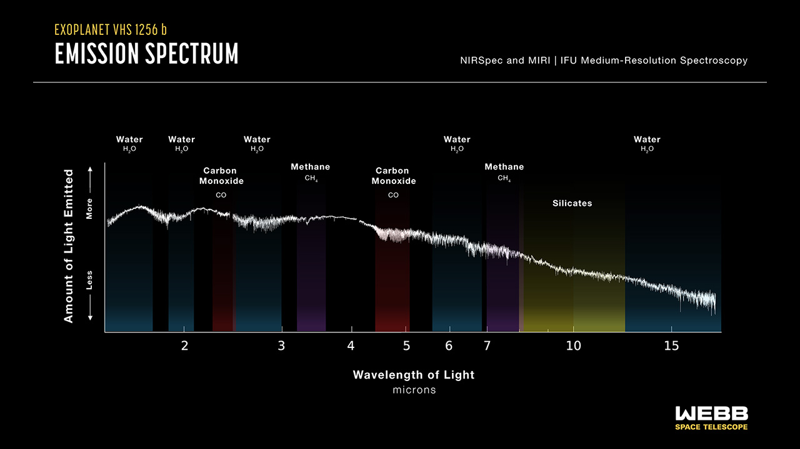

---

##### Summary
Using NIRSpec and MIRI on JWST, the Early-release Science Program for Direct Observations of Exoplanetary Systems (Program #1386, PI: Sasha Hinkley) published the highest signal-to-noise, broadest wavelength coverage spectrum of planetary mass companion to date. We detected water, carbon dioxide, carbon monoxide, silicate condensates and more within the spectrum (highlighted below).

You can read the paper and get the spectra <a href = "https://ui.adsabs.harvard.edu/abs/2023ApJ...946L...6M/abstract"> here. </a>

---

##### Figure: Emission spectrum of VHS 1256b with features highlighted. The graphic was used in the NASA/STSci press release   <a href = "https://webbtelescope.org/contents/news-releases/2023/news-2023-105"> here. </a>

---
